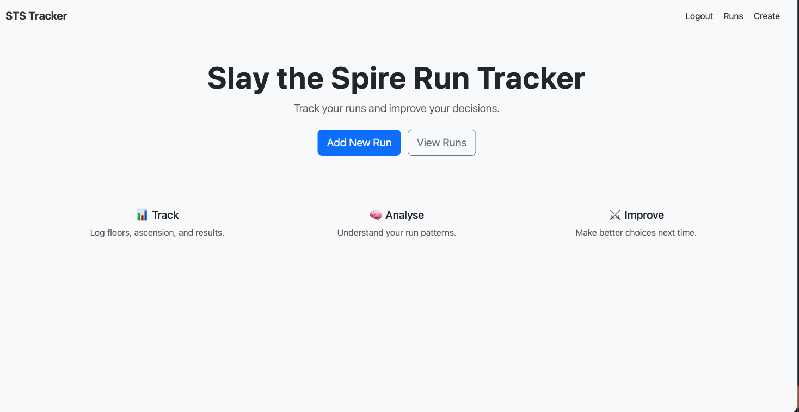
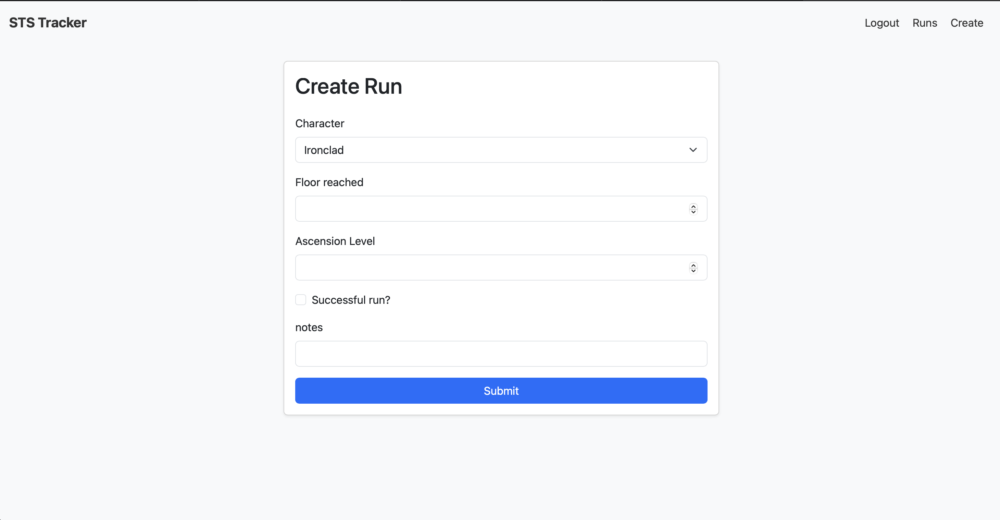
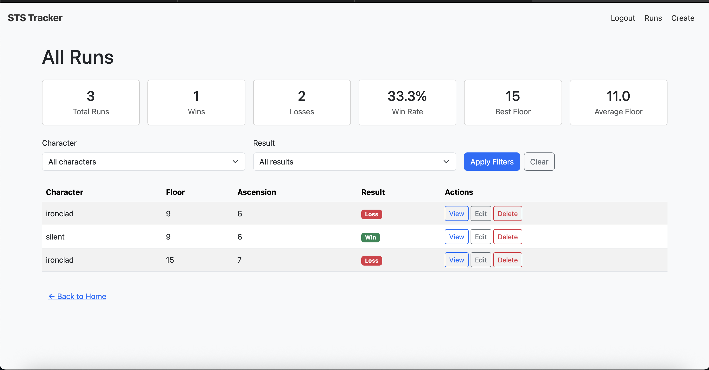

# Slay the Spire Run Tracker

A Flask web application for tracking Slay the Spire runs, viewing basic run statistics, and filtering previous attempts by character and result.

I built this project to practise developing a complete database-backed web app, including routes, forms, user authentication, CRUD functionality, validation, filtering and relational data modelling.

## Features

- User registration and login
- Add, view, edit and delete game runs
- Track run details such as character, floor reached, ascension level, win status and notes
- View summary statistics including total runs, wins, losses, win rate, best floor and average floor
- Filter runs by character and result
- Form validation for floor reached and ascension level
- Database-backed records using SQLAlchemy
- Bootstrap-based interface

## Tech Stack

- Python
- Flask
- Flask-Login
- Flask-WTF / WTForms
- SQLAlchemy
- SQLite
- HTML/CSS
- Bootstrap

## Screenshots

### Home Page



### Create Run



### All Runs



## Why I Built It

I wanted to build a small but complete web application around something I was interested in, rather than only working through isolated exercises. The project helped me practise taking an idea from a simple concept to a working application with database-backed records, authentication, form handling and user flows.

## What I Practised

- Structuring a Flask application
- Building routes and templates
- Creating SQLAlchemy models and relationships
- Implementing CRUD operations
- Handling user registration and login
- Validating form input with WTForms
- Filtering database queries using request parameters
- Calculating summary statistics from stored records
- Debugging across a full application flow
- Writing clearer project documentation

## Running Locally

Clone the repository:

```bash
git clone https://github.com/RememberEliT/slay-the-spire-run-tracker.git
cd slay-the-spire-run-tracker